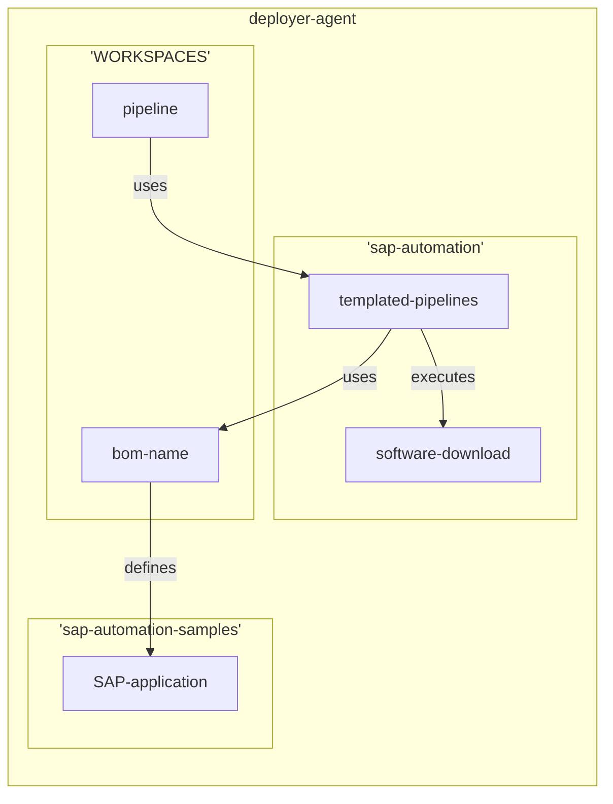

# Project

This repo contains both the sample Terrraform configuration files for SDAF and the Bill of Material files for the SAP installations

## Contributing

This project welcomes contributions and suggestions.  Most contributions require you to agree to a
Contributor License Agreement (CLA) declaring that you have the right to, and actually do, grant us
the rights to use your contribution. For details, visit https://cla.opensource.microsoft.com.

When you submit a pull request, a CLA bot will automatically determine whether you need to provide
a CLA and decorate the PR appropriately (e.g., status check, comment). Simply follow the instructions
provided by the bot. You will only need to do this once across all repos using our CLA.

This project has adopted the [Microsoft Open Source Code of Conduct](https://opensource.microsoft.com/codeofconduct/).
For more information see the [Code of Conduct FAQ](https://opensource.microsoft.com/codeofconduct/faq/) or
contact [opencode@microsoft.com](mailto:opencode@microsoft.com) with any additional questions or comments.

## How it works

During software acquisition both the sample repositories and the sap-automation repositories need to be present on the deployer-agent. Each of the repositories will be mapped using the following:

- sap-automation will be mapped to ```/sap-automation```
- customer configuration repository will be mapped to ```/config```
- sample repository will be mapped to ```/samples```

During execution the repositories will interact with each other by using the following:



The Ansible playbooks leverage a variable ```BOM_directory``` that should contain the path to the cloned 'sap-samples' repository. 

## Trademarks

This project may contain trademarks or logos for projects, products, or services. Authorized use of Microsoft
trademarks or logos is subject to and must follow
[Microsoft's Trademark & Brand Guidelines](https://www.microsoft.com/en-us/legal/intellectualproperty/trademarks/usage/general).
Use of Microsoft trademarks or logos in modified versions of this project must not cause confusion or imply Microsoft sponsorship.
Any use of third-party trademarks or logos are subject to those third-party's policies.
